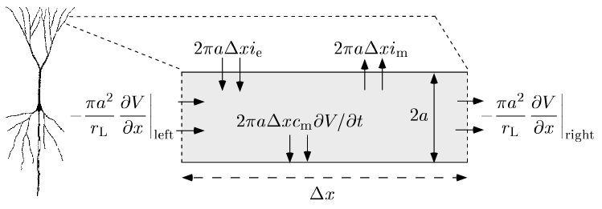
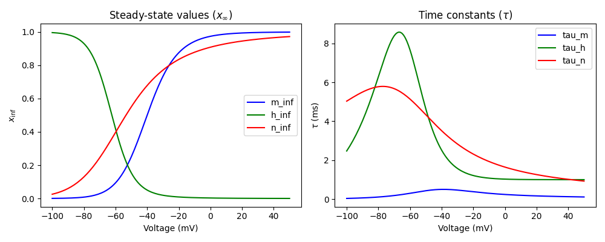
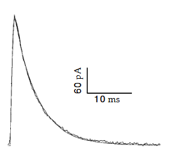

# Hodgkin-Huxley Model

## Cable Equation Derivation

For a cylindrical segment with radius $a$, intracellular resistivity $r_L$, and membrane capacitance per unit area $c_m$:

Longitudinal resistance:
$$
R_L = \frac{r_L \Delta x}{\pi a^2}
$$

Longitudinal voltage drop:
$$
\Delta V = -I_L R_L = -I_L \frac{r_L \Delta x}{\pi a^2}
$$

Longitudinal current:
$$
I_L = \frac {-\pi a^2}{r_L} \frac{\Delta V}{\Delta x}
% \rightarrow \frac {-\pi a^2}{r_L} \frac{\partial V}{\partial x}
$$

Membrane current:
$$
i_m = \sum_i g_i(V - E_i)
$$

The sum of the Longitudinal current coming in and out of the segment, the membrane current, and external current ($i_e$) is equal to the total capacitance of the neuron $2\pi a \Delta x c_m$ times the rate of change of the membrane potential $\frac{\partial V}{\partial t}$:

> The longitudinal input current is with respect to the previous segment/neuron, and is assumed to be equal to the longitudinal output current with respect to the next segment/neuron which have the same radius $a$, specific resistivity $r_L$, and length $\Delta x$.

<!-- $$
2 \pi a \Delta x c_m \frac{\partial V}{\partial t} = -\left( \frac{\pi a^2}{r_L} \frac{\partial V}{\partial x} \right) \bigg|_{\text{left}} + \left( \frac{\pi a^2}{r_L} \frac{\partial V}{\partial x} \right) \bigg|_{\text{right}} - 2\pi a \Delta x (i_m - i_e)
$$ -->
$$
2 \pi a \Delta x c_m \frac{\partial V}{\partial t} = -\left( \frac{\pi a^2}{r_L} \frac{\Delta V}{\Delta x} \right) \bigg|_{\text{in}} + \left( \frac{\pi a^2}{r_L} \frac{\Delta V}{\Delta x} \right) \bigg|_{\text{out}} - 2\pi a \Delta x (i_m - i_e)
$$

Dividing both sides by $2 \pi a \Delta x$ and taking the limit as $\Delta x \to 0$ gives the cable equation:

$$
c_m \frac{\partial V}{\partial t} = \frac{a}{2 r_L} \frac{\partial^2 V}{\partial x^2} - i_m + i_e
$$

---

## Multi-Compartment Approximation

The neuron is divided into discrete compartments indexed by $\mu$. Each has membrane potential $V_\mu$ and membrane area $A_\mu$. For a cable without branching:

The longitudinal resistance between compartments $\mu$ and $\mu'$:
$$
R^{(\mu,\mu')}_L = \frac{r_L L_\mu}{2 \pi a_\mu^2} + \frac{r_L L_{\mu'}}{2 \pi a_{\mu'}^2}
$$

The conductance between compartments $\mu$ and $\mu'$ is the reciprocal of the resistance divided by the area of compartment $\mu$, $A_\mu = 2 \pi a_\mu^2 L_\mu$:

$$
g_{\mu,\mu'} = \frac{1}{R^{(\mu,\mu')}_L A_\mu} = \frac{a_\mu a_{\mu'}^2}{r_L L_\mu (L_\mu a_{\mu'}^2 + L_{\mu'} a_\mu^2)}
$$

Letting the length of each compartment be denoted by $L_\mu$, the equation for compartment $\mu$ is:

$$
c_m \frac{dV_\mu}{dt} = -i^\mu _m + i^\mu _e + g_{\mu,\mu+1}(V_{\mu+1} - V_\mu) + g_{\mu,\mu-1}(V_{\mu-1} - V_\mu)
$$

---

## Synaptic Transmission

As with a voltage-dependent conductance, a synaptic conductance can be written as the product of a maximal conductance and an open channel probability, $g_s = \bar{g}_s P$, where $P$ can be expressed as the joint probability of transmitter binding and channel opening, $P = P_{\text{rel}} P_s$.

$$
c_m \frac{dV}{dt} = -i_m + i_e - \bar{g}_s P (V - E_s)
$$
where $E_s$ is the synaptic reversal potential, which is typically around 0 mV for excitatory synapses and around -70 mV for inhibitory synapses.

The synaptic open channel probability $P$ has complex dynamics, but can be simplified to a exponentially decaying function that has a discrete jump after a presynaptic spike time.

> or in the multi-compartment model for compartment $\mu$:
> $$
> c_m \frac{dV_\mu}{dt} = -i^\mu _m + i^\mu _e - \bar{g}_s P (V_\mu - E_s) +  g_{\mu,\mu+1}(V_{\mu+1} - V_\mu) + g_{\mu,\mu-1}(V_{\mu-1} - V_\mu)
> $$

## Appendix A — Conductance-based neuron models

Hodgkin–Huxley membrane current can be expressed as a sum of a leakage current, a delayed-rectifier K⁺ current, and a transient Na⁺ current:

$$
i_m=g_L(V-E_L)+g_K,n^4(V-E_K)+g_{Na},m^3h(V-E_{Na}).
$$

where $m,h,n$ are dynamic gating variables between 0 and 1.

For any gate $z\in{m,h,n}$:

$$
\frac{dz}{dt}=\alpha_z(V)(1-z)-\beta_z(V)z
\quad\Longrightarrow\quad
\tau_z(V)\frac{dz}{dt}=z_\infty(V)-z,
$$

where

$$
\tau_z=1/(\alpha_z+\beta_z)
$$

and

$$
z_\infty=\frac{\alpha_z}{(\alpha_z+\beta_z)}
$$

Numerical integration:

Over small $\Delta t$, integrate $V$ and then each gate with the same stable update:

$$
\tau_z\frac{dz}{dt}=z_\infty-z
\quad\Rightarrow\quad
z(t+\Delta t)=z_\infty+(z(t)-z_\infty)e^{-\Delta t/\tau_z}.
$$

## Appendix B - Synaptic open probability $P_s(t)$ and postsynaptic conductance

If $k$ transmitter molecules bind to open a receptor:

$$
\frac{dP_s}{dt}=\alpha_s(1-P_s)-\beta_s P_s,\quad \alpha_s\propto[\text{transmitter}]^k.
$$

> "Here, $\beta_s$ determines the closing rate of the channel and is usually assumed to be a constant. The opening rate, $\alpha_s$, on the other hand, depends on the concentration of transmitter available for binding to the receptor. If the concentration of transmitter at the site of the synaptic channel is [transmitter], the probability of finding k transmitter molecules within binding range of the channel is proportional to [transmitter]k, and $\alpha_s$ is some constant of proportionality times this factor...
> As a simple model of transmitter release, we assume that the transmitter concentration in the synaptic cleft rises extremely rapidly after vesicle release, remains at a high value for a period of duration T, and then falls rapidly to 0. Thus, the transmitter concentration is modeled as a square pulse."

While the transmitter concentration in the cleft is nonzero, $\alpha_s$ is so much larger than $\beta_s$ that we can ignore the term involving $\beta_s$ in the above equation. Under this assumption

$$
P_s(t) = 1 + (P_s(0) − 1) \exp(−\alpha_st) \quad \text{for } 0 ≤ t ≤ T
$$

The open probability takes its maximum value at time $t = T$ and then, for $t ≥ T$, decays exponentially at a rate determined by the constant $\beta_s$, and $\alpha_s$ is 0 after because transmitter concentration rapidly falls after T

$$
P_s(t) = P_s(T) \exp(−\beta_s(t − T)) \quad \text{for } t ≥ T.
$$

If $P_s(0) = 0$, as it will if there is no synaptic release immediately before the release at t = 0, the first equation simplifies to $P_s(t) = 1 − \exp(−\alpha_st)$ for $0 ≤ t ≤ T$, and this reaches a maximum value $P_{\max} = 1 − \exp(−\alpha_sT)$. In terms of this parameter the synaptic open probability at time $T$ in the general case can be written as

$$
P_s(T) = P_s(0) + P_{\max}(1 − P_s(0))
$$

The figure shows a fit to a recorded postsynaptic current using this formalism. In this case, $\beta_s$ was set to $0.19 ms^{−1}$. The transmitter concentration was modeled as a square pulse of duration $T$ = 1 ms during which $\alpha_s = 0.93 ms^{−1}$. Inverting these values, we find that the time constant determining the rapid rise seen in the figure is 0.9 ms, while the fall of the current is an exponential with a time constant of 5.26 ms.

### Spike Trains

Assuming a fast synapse, the rise of the conductance following a presynaptic action potential is so rapid that it can be approximated as instantaneous. Between spikes, $P_s$ decays exponentially, and after each spike, $P_s$ jumps by an amount proportional to the distance from its maximum value:

$$
\tau_s\frac{dP_s}{dt} = -P_s, \qquad P_s \rightarrow P_s+P_{\max}(1-P_s).
$$

<!-- ### Slower Synapses

**Waveform choices.**

* Double exponential: $P_s=P_{\max}B\left(e^{-t/\tau_1}-e^{-t/\tau_2}\right)$ with normalized $B$. Rise time $\tau_{\text{rise}}=\tau_1\tau_2/(\tau_1-\tau_2)$.
* Alpha function: $P_s=P_{\max}\left(\frac{t}{\tau_s}\right)e^{1-t/\tau_s}$. Peaks at $t=\tau_s$.

**NMDA voltage block.**
NMDA current includes a voltage- and Mg$^{2+}$-dependent factor:

$$
I_{\text{NMDA}}=g_{\text{NMDA}},G_{\text{NMDA}}(V),P_s,(V-E_{\text{NMDA}}),
\quad
G_{\text{NMDA}}=\Big(1+\frac{[\text{Mg}^{2+}]}{3.57,\text{mM}}e^{-V/16.13,\text{mV}}\Big)^{-1}.
$$ -->

## Appendix C — Transmitter release probability $P_{\text{rel}}(t)$ and short-term plasticity

$P_{\text{rel}}$ denotes the average release probability across one or many independent sites. It is described using a simple nonmechanistic model that has similarities to the model of $P_s$. For both facilitation and depression, the release probability after a long period of presynaptic silence is $P_{\text{rel}} = P_0$.

$$
\tau_P\frac{dP_{\text{rel}}}{dt}=P_0-P_{\text{rel}}
$$

**Spike-triggered updates.**

* Facilitation: $P_{\text{rel}}\rightarrow P_{\text{rel}}+f_F(1-P_{\text{rel}}), (0\le f_F\le1)$
* Depression: $P_{\text{rel}}\rightarrow f_DP_{\text{rel}}, (0\le f_D\le1)$.

### Analysis for Poisson Spike Trains

Assume presynaptic spikes form a Poisson process with rate $r$. Between spikes, $P_{\text{rel}}$ relaxes exponentially to $P_0$:
$$
\tau_P \frac{dP_{\text{rel}}}{dt}=P_0-P_{\text{rel}}
$$

The general solution is

$$
P_{\text{rel}}(t) = P_0 + [P_{\text{rel}}(t_0) - P_0] e^{-(t-t_0)/\tau_P}.
$$

#### Facilitation

**Spike rule.** After a spike,
$$
P_{\text{rel}}\rightarrow P_{\text{rel}}+f_F(1-P_{\text{rel}})
$$
**One ISI.** Let two spikes be separated by $\tau$. If $P_{\text{rel}}$ equals its mean $\langle P_{\text{rel}}\rangle$ just *before* the first spike, then just *after* that spike it is $\langle P_{\text{rel}}\rangle+f_F(1-\langle P_{\text{rel}}\rangle)$. During the interval $\tau$ it decays towards it's resting value $P_0$, and just before the next spike it is

$$
P_0+\big(\langle P_{\text{rel}}\rangle+f_F(1-\langle P_{\text{rel}}\rangle)-P_0\big)e^{-\tau/\tau_P}
$$

**Average decay factor over Poisson ISIs.**

For a Poisson process with mean firing rate $r$, the ISI distribution is exponential:

$$
p(\tau) = r e^{-r\tau}, \quad \tau \ge 0.
$$
This gives the probability density for the time gap between spikes.

The expected decay factor over a random interval $\tau$ is
$$
\langle e^{-\tau/\tau_P} \rangle = \int_0^\infty e^{-\tau/\tau_P} p(\tau)d\tau = r\int_0^\infty e^{-r\tau-\tau/\tau_P}d\tau  = \frac{r}{r + 1/\tau_P} = \frac{r\tau_P}{1 + r\tau_P}.
$$

**Consistency equation.** For steady state,
$$
\langle P_{\text{rel}}\rangle
= P_0+\big(\langle P_{\text{rel}}\rangle+f_F(1-\langle P_{\text{rel}}\rangle)-P_0\big)\frac{r\tau_P}{1+r\tau_P}
$$

**Solve.**
$$
\langle P_{\text{rel}}\rangle=\dfrac{P_0+f_F r\tau_P}{1+r f_F \tau_P}
$$

**Behavior.** Low $r$: $\langle P_{\text{rel}}\rangle\approx P_0$. High $r$: $\langle P_{\text{rel}}\rangle\to 1$. Transmission rate equals $r\langle P_{\text{rel}}\rangle$, so it grows $\approx P_0 r$ at low $r$ and $\approx r$ at high $r$.

## Appendix